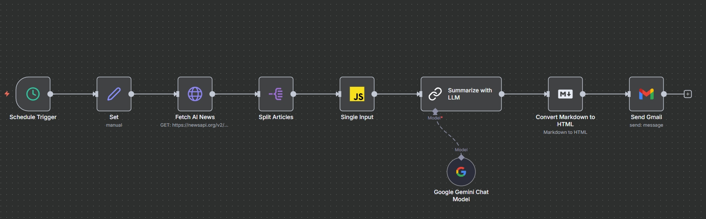

# 📰 Daily AI Briefing – Automated AI News Digest

This repository contains an automated newsletter workflow built with **n8n**, designed to fetch the latest AI news, summarize it using **Gemini**, convert it into HTML, and email the final daily briefing — fully hands-off.

---

## 📋 Overview

The workflow retrieves fresh AI-related news articles from the last 24 hours, restructures them into a single prompt, generates a concise newsletter, converts it into HTML, and emails it.

### 🔧 Key Capabilities

- Daily scheduled execution  
- Fetches top AI articles via **NewsAPI**  
- Builds a single aggregated prompt for LLM summarization  
- Summarizes articles using **Google Gemini**  
- Converts markdown → HTML  
- Sends the final newsletter via **Gmail**

---

## 🏗️ Workflow Architecture



### **High-Level Flow**

1. **Schedule Trigger** — runs daily at 11:30 AM 
2. **Set Topic** — defines `"Artificial Intelligence News"` as the search filter 
3. **Fetch AI News (NewsAPI)** — retrieves latest 10 articles from last 24 hours using query params like `q`, `language`, `from`, and `pageSize` 
4. **Split Articles** — expands `articles[]` into individual items for processing  
5. **Build Prompt Input (Code Node)** — merges all article info into a single aggregated markdown-friendly input for LLM summarization
6. **Summarize with Gemini (LLM Chain)** — generates a newsletter with:  
   - catchy headline  
   - 4–6 bullet points  
   - “One surprising thing” section  
   - clean markdown output only 
7. **Markdown → HTML Conversion** — converts Gemini’s markdown summary into email-ready HTML  
8. **Send Gmail** — sends the final briefing with HTML body and dynamic date in subject line

---

## 🧩 Workflow Nodes

| Node | Description |
|------|-------------|
| **Schedule Trigger** | Executes the workflow daily at 11:30 AM |
| **Set** | Assigns the topic `"Artificial Intelligence News"` |
| **HTTP Request – Fetch AI News** | Pulls latest 10 AI news articles from NewsAPI |
| **Split Articles** | Splits `articles` array into items |
| **Code – Single Input** | Converts all article details into one combined prompt block |
| **Gemini Chat Model** | LLM backend for summarization |
| **Chain LLM – Summarize with LLM** | Generates newsletter markdown |
| **Markdown – Convert to HTML** | Converts markdown summary to HTML |
| **Gmail – Send Email** | Sends the daily briefing email |

---

## 🤖 Tech Stack

| Category | Tool |
|---------|------|
| Workflow Automation | **n8n** |
| News Fetching | **NewsAPI** |
| AI Summarization | **Google Gemini (LangChain LLM)** |
| Email Delivery | **Gmail API (OAuth2)** |
| Logic | **JavaScript (n8n Code node)** |

---

## 🧠 AI Logic Summary

- Each article is restructured into a clean markdown block containing:  
  *title, description, source, publishedAt, link*  
- Gemini receives explicit instructions to produce:  
  - a headline  
  - 4–6 bullets  
  - a short “one surprising thing”  
  - clean markdown only  
- Markdown is converted to HTML before sending.

---

## 📬 Email Output Format

Final email contains:

- A headline  
- Key bullet-point updates  
- A short highlight  
- Clean HTML formatting

Dynamic subject line example:

```
📰 Your Daily AI Briefing – 2025-02-22
```

---

## 📁 File Structure

```
Daily-AI-Briefing/
│
├── workflow.json
├── assets/
│   └── workflow.png
└── README.md
```

---

## 🧩 Future Improvements

- Multi-topic rotation (AI, AGI, Robotics, etc.)
- Logging to Google Sheets or Notion
- Auto-post to LinkedIn or Twitter/X
- Add fallback summarization if NewsAPI fails

---

## 👤 Author

**Dhyan Patel**  
AI/ML & Automation Builder  
🔗 [LinkedIn](https://linkedin.com/in/dhyan2815) • [GitHub](https://github.com/dhyan2815)
