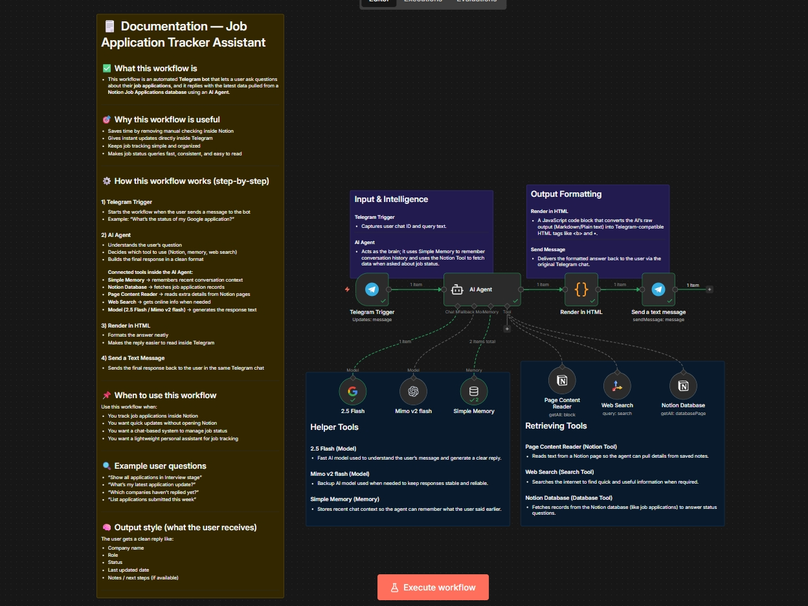

# 🤖 Job Application Tracker Assistant (Telegram + Notion + AI)

A clean **Telegram bot workflow** that answers job application questions by pulling real-time data from a **Notion database**, powered by an **AI Agent**.

---

## ✅ What this workflow does

This workflow allows users to message a Telegram bot and ask things like:

- “What’s the status of my Microsoft application?”
- “Show all applications in Interview stage”
- “Which companies haven’t replied yet?”

The AI Agent reads the request, fetches matching results from **Notion**, and sends a clean reply back in Telegram.

---

## 🏗️ Workflow Architecture

---

## 🎯 Why this workflow exists

Tracking jobs in Notion is useful, but checking it manually is slow.

This workflow solves that by:

- Giving **instant job status updates**
- Keeping everything inside **Telegram**
- Reducing manual effort
- Making job tracking feel like a simple chat

---

## 🧠 When to use this workflow

Use this workflow if you:

- Track job applications inside a Notion database
- Want a fast way to check application status
- Need quick answers without opening Notion
- Want a personal job tracker assistant in Telegram

---

## 🧩 Workflow Overview (Nodes)

### 1) Telegram Trigger
**Purpose:** Starts the workflow when a user sends a message to the bot.  
**Input:** Telegram chat message + chat ID  
**Output:** Passes the user message into the AI Agent

---

### 2) AI Agent
**Purpose:** Acts as the brain of the workflow.  
It understands the user’s question and decides what tool to use.

**Rules followed by the Agent:**
- Use **Notion Database first** for job-related queries
- Use **Page Content Reader** only when one Notion page is found
- Use **Web Search** only when Notion does not contain the info
- Never invent job statuses or company names
- Ask for clarification if the request is unclear

---

### 3) Render in HTML (Code Node)
**Purpose:** Converts the AI output into Telegram-safe HTML format.

This node handles:
- Preventing broken formatting
- Removing unsafe characters that cause Telegram errors
- Converting markdown-style text into clean bullet output

---

### 4) Send a Text Message
**Purpose:** Sends the final formatted answer back to the user in Telegram.

**Output format:**
- Clean bullet points
- Telegram HTML formatting enabled (`parse_mode: HTML`)

---

## 🧰 Tools Connected to the AI Agent

### 🧠 Simple Memory
Stores recent chat context so the assistant can remember the conversation.

**Used when:** user asks follow-up questions like  
“what about the previous one?”

---

### 🗃️ Notion Database
Fetches job application records from the Notion database.

**Used when:** user asks about company, role, status, or dates.

---

### 📄 Page Content Reader
Reads detailed notes inside a specific Notion page.

**Used when:** there is exactly **one** matching Notion result and more detail is needed.

---

### 🌐 Web Search using Tavily
Searches the internet for extra information if Notion does not have it.

**Used when:** user asks something external like company background or updates.

---

### ⚡ Models (2.5 Flash + Mimo v2 flash)
AI models used to understand the query and generate a response.

- **2.5 Flash:** fast main model
- **Mimo v2 flash:** backup model for reliability

---

## 💬 Example User Prompts

- “Show my latest applications”
- “Which ones are rejected?”
- “What’s my status at Amazon?”
- “List all applied this month”
- “Any interview scheduled?”

---

## 📌 Output Example (Telegram Reply)

- Company: Google  
- Role: Software Engineer Intern  
- Status: Interview  
- Applied On: 2026-01-05  
- Notes: Waiting for next round email  

---

## 🔒 Notes / Limitations

- The assistant will **not guess** missing information
- If multiple results match, it may ask the user to be more specific
- Replies are kept short to fit Telegram message limits

---
