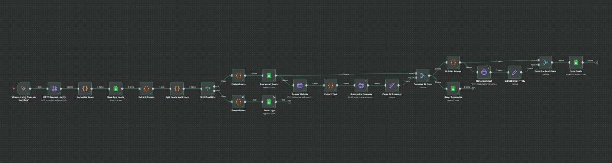

# 🧠 AI Workflow for Lead Generation Automation

This repository contains a complete **AI-driven workflow automation system** built with **n8n**, designed to streamline **lead scraping, validation, enrichment, and outreach email generation** using APIs and large language models.

---

## 📋 Overview

The workflow automates the process of identifying potential leads, processing them through AI enrichment steps, and preparing personalized outreach emails — all within a modular, no code environment.

### 🔧 Key Capabilities

* Automated lead scraping using **Apify API**
* Lead normalization and **domain extraction**
* Intelligent error handling and logging
* Website content scraping + summarization using **Gemini AI**
* Personalized **HTML outreach email generation**
* Data persistence in **Google Sheets**

---

## 🏗️ Workflow Architecture



### High-Level Flow

1. **Trigger → Apify Scraper (HTTP Request)**
   Fetches raw company data from Apify.
2. **Normalize Data → Google Sheets (Raw Leads)**
   Cleans, formats, and stores initial leads.
3. **Extract Domains + Error Split**
   Identifies valid domains and logs invalid entries.
4. **Website Scraping & Summarization (Gemini AI)**
   Scrapes each website, extracts readable text, and summarizes business context.
5. **HTML Outreach Email Generation (Gemini AI)**
   Generates personalized, ready-to-send HTML emails.
6. **Sheets Integration**
   Stores all processed data and email outputs in Google Sheets.

---

## 🧩 Workflow Nodes

| Node                                                  | Description                                |
| ----------------------------------------------------- | ------------------------------------------ |
| 1. **Manual Trigger**                                 | Starts the automation                      |
| 2. **HTTP Request (Apify)**                           | Fetches business listings                  |
| 3. **Function – Normalize Items**                     | Cleans and structures lead data            |
| 4. **Google Sheets (Append Rows)**                    | Stores initial raw data                    |
| 5. **Function – Extract Domains**                     | Extracts valid website domains             |
| 6. **Function – Split Leads & Errors**                | Separates valid/invalid leads              |
| 7. **IF Node (type=leads)**                           | Conditional routing based on validity      |
| 8. **Google Sheets – Processed Leads**                | Saves verified leads                       |
| 9. **Google Sheets – Error Logs**                     | Logs invalid or missing domains            |
| 10. **Google Sheets – Fetch Leads for Summarization** | Reads processed leads                      |
| 11. **HTTP Request – Scrape Website**                 | Fetches site HTML                          |
| 12. **Function – Extract Text from HTML**             | Converts HTML to readable text             |
| 13. **HTTP Request – Summarize Business (Gemini AI)** | Creates short summaries                    |
| 14. **Google Sheets – Summarized Leads**              | Stores summaries                           |
| 15. **Google Sheets – Fetch Summarized Leads**        | Reads summarized data                      |
| 16. **Function – Build Email Prompt**                 | Creates AI input for personalized outreach |
| 17. **HTTP Request – Generate HTML Email (Gemini)**   | Produces the final email template          |
| 18. **Google Sheets – Outreach Emails**               | Saves final HTML output                    |

---

## 🤖 Tech Stack

| Category                            | Tool                                       |
| ----------------------------------- | ------------------------------------------ |
| Workflow Automation                 | **n8n Cloud**                              |
| Web Scraping                        | **Apify API**                              |
| Data Storage                        | **Google Sheets API**                      |
| AI Summarization & Email Generation | **Gemini Pro API**                         |
| Programming Logic                   | **JavaScript (within n8n Function nodes)** |

---

## 🧠 AI Logic Summary

* **Summarization Prompt:** Extracts key information from website text using Gemini.
* **Email Prompt:** Generates short 4–5 sentence HTML emails with a natural tone and CTA button.
* **Error Handling:** Automatically routes failures or missing domains to separate logs.

---

## 📊 Output Sheets

| Sheet Name         | Purpose                      |
| ------------------ | ---------------------------- |
| `Raw_Leads`        | Initial Apify data           |
| `Processed_Leads`  | Validated leads with domains |
| `Error_Logs`       | Invalid or missing leads     |
| `Summarized_Leads` | AI-generated summaries       |
| `Outreach_Emails`  | Personalized HTML emails     |

---

## 🚀 Results

* **100+ leads** processed and enriched automatically
* **Zero manual filtering** after domain extraction
* **AI summaries & outreach emails** generated per lead
* Modular workflow enabling plug-and-play component upgrades

--- 

## 📁 Repository Structure

```
AI-Workflow-E2M/
│
├── n8n_workflow.json
├── architecture_diagram.png
├── README.md
```

---

## 🧩 Future Improvements

* Automate sending emails via Gmail API or SMTP.
* Add sentiment scoring or lead prioritization.
* Integrate CRM sync (HubSpot / Notion) for pipeline tracking.

---

## 👤 Author

**Dhyan Patel**
Final-year Engineering Student | AI/ML & Automation Enthusiast
🔗 [LinkedIn](https://linkedin.com/in/dhyan2815) • [GitHub](https://github.com/dhyan2815)

---

> ⚙️ *Built entirely on n8n Cloud – orchestrating AI, data enrichment, and automation in one workflow.*
#
