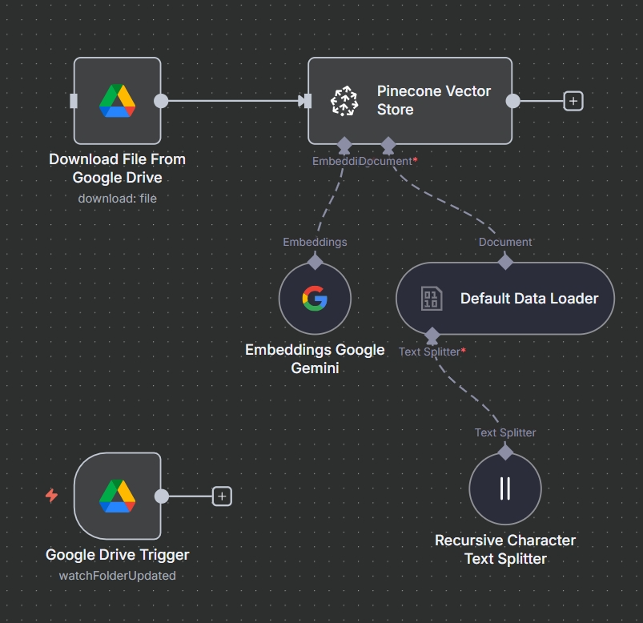
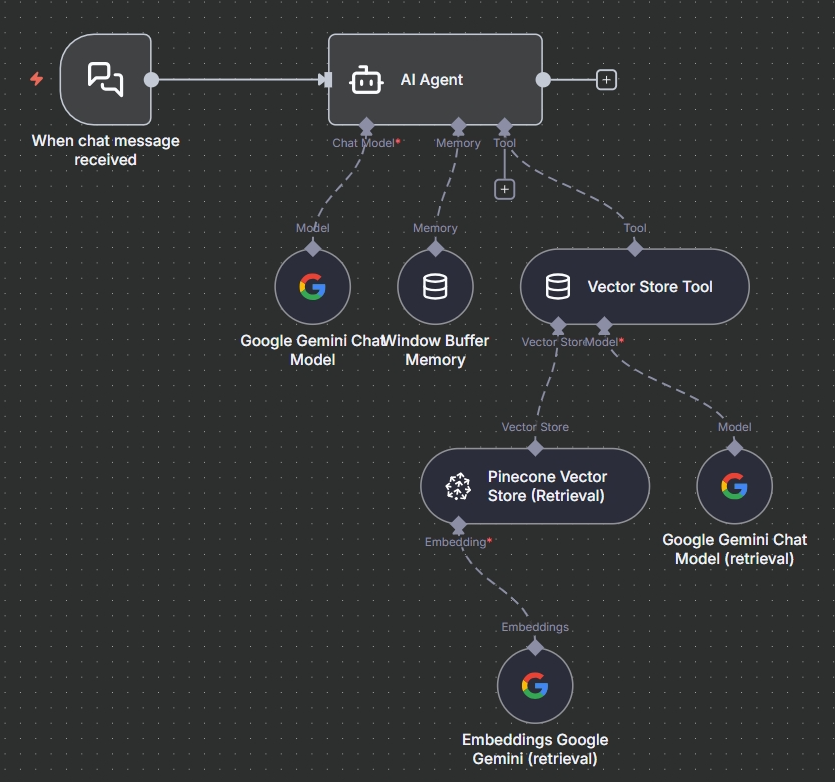

# 💬 RAG Chatbot – Internal Document QA Assistant

This repository contains an **AI-powered Retrieval-Augmented Generation (RAG) chatbot workflow** built with **n8n**, designed to let employees query internal documents stored in **Google Drive**, retrieve the most relevant chunks via **Pinecone**, and generate accurate, context-grounded answers using **Google Gemini**.

---

## 📋 Overview

The workflow automatically ingests new or updated company documents from Google Drive, indexes them into Pinecone using Gemini embeddings, and exposes a **chat interface** that answers questions using a LangChain Agent with tool access.

### 🔧 Key Capabilities

- Automatically watches a Google Drive folder for **new or updated documents**
- Embeds documents using **Google Gemini Embeddings**
- Stores vectorized chunks inside **Pinecone**
- Uses a LangChain **Agent** with a VectorStore retrieval tool for question answering
- Supports streaming conversational memory using **window buffer**
- Responds only based on internal company documents (strict RAG behavior)
- Delivers concise, accurate answers for employees

---

## 🏗️ Workflow Architecture




### High-Level Flow

1. **Google Drive Trigger – File Created / Updated**  
   Watches a specific Drive folder for new or updated documents
2. **Download File**  
   Downloads the file metadata + content from Google Drive
3. **Default Data Loader**  
   Loads binary file contents into the RAG pipeline for processing
4. **Recursive Character Text Splitter**  
   Splits text into overlapping chunks for embeddings (chunkOverlap: 100) 
5. **Gemini Embeddings**  
   Generates embeddings for each chunk using Google Gemini 
6. **Pinecone Vector Store (Insert Mode)**  
   Stores the generated embeddings into the `rag-chatbot` Pinecone index 
7. **Chat Trigger – When Message Received**  
   Receives an incoming chat message and initiates the agent workflow
8. **Vector Store Tool ("company_documents_tool")**  
   Allows the AI Agent to retrieve relevant document chunks via Pinecone (retrieval mode) 
9. **Gemini LLM (Retrieval)**  
   Used by the retrieval tool to generate relevant answers from retrieved chunks 
10. **AI Agent**  
    A LangChain agent with system instructions enforcing:  
    - answer only from company documents  
    - use the retrieval tool  
    - respond with a fallback when no answer is found  
    Includes **window memory** for short conversation context 

---

## 🧩 Workflow Nodes

| Node | Purpose |
|------|---------|
| **Google Drive Trigger (File Created)** | Detects newly added documents |
| **Google Drive Trigger (Updated)** | Detects modified documents |
| **Download File / Download File From Drive** | Retrieves file content |
| **Default Data Loader** | Converts binary documents into text for indexing |
| **Text Splitter – Recursive** | Splits text into overlapping chunks |
| **Gemini Embeddings** | Converts text chunks into embeddings |
| **Pinecone Vector Store (Insert)** | Stores embeddings for retrieval |
| **Pinecone Vector Store (Retrieval)** | Retrieves relevant chunks for answering |
| **Vector Store Tool** | Exposes retrieval capabilities to the agent |
| **Gemini Chat Model** | LLM used to generate responses |
| **Window Memory** | Maintains short conversation context |
| **Chat Trigger** | Handles user queries |
| **AI Agent** | Orchestrates retrieval + reasoning + generation |


---

## 🤖 Tech Stack

| Category | Tool |
|----------|------|
| Workflow Automation | **n8n** |
| LLM | **Google Gemini** |
| Embeddings | **Google Gemini Embeddings** |
| Vector Database | **Pinecone** |
| File Storage | **Google Drive** |
| Framework | **LangChain Agent + Tools + Memory** |

---

## 🧠 AI Logic Summary

Your chatbot operates with a strict RAG pipeline:

- Documents → Chunked → Embedded → Stored in Pinecone  
- Chat queries → Retrieval tool → Relevant chunks → Gemini → Final Answer

**System Behavior:**

- Answers only from internal documents
- Uses a dedicated retrieval tool `"company_documents_tool"`
- If no supporting context exists:  
  **"I cannot find the answer in the available resources."**
- Short-term memory (Window Memory) keeps conversation continuity

---

## 📁 Repository Structure

```
RAG-Chatbot/
│
├── workflow.json
├── assets/
│   └── workflow.png   <-- Export from n8n
└── README.md
```

---

## 🚀 Results

- Fully automated RAG ingestion pipeline  
- Secure internal chatbot for company documents  
- Google Drive → Pinecone → Gemini → Chat  
- Easy to expand by adding more documents to the Drive folder

---

## 🧩 Future Improvements

- Add multi-file processing batching  
- Add document deletion syncing with Pinecone  
- Add Notion/SharePoint as additional data sources  
- Add streaming responses or UI integration

---
## 👤 Author

**Dhyan Patel**
Final-year Engineering Student | AI/ML & Automation Enthusiast
🔗 [LinkedIn](https://linkedin.com/in/dhyan2815) • [GitHub](https://github.com/dhyan2815)

---

> ⚙️ *Built entirely on n8n Cloud – orchestrating AI, data enrichment, and automation in one workflow.*
#