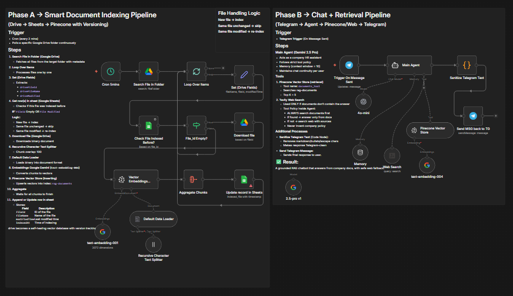

# AI Powered RAG-Based Automated Assistant

This repository contains an **enhanced AI-powered Retrieval-Augmented Generation (RAG) chatbot workflow** built with **n8n**, featuring a self-healing document indexing pipeline with versioning and a Telegram-based chat interface for employees to query internal company documents.

---

## Overview

The workflow is divided into two independent pipelines:

### Phase A – Smart Document Indexing Pipeline
(Google Drive → Google Sheets → Pinecone with Versioning)

- Automatically polls a Google Drive folder every 5 minutes
- Tracks file changes (new, modified, unchanged) via Google Sheets
- Only re-indexes files that are new or modified (self-healing)
- Stores embeddings in Pinecone with namespace support per file

### Phase B – Chat + Retrieval Pipeline
(Telegram → Agent → Pinecone/Web → Telegram)

- Telegram bot interface for employees
- Uses Gemini 2.5 Pro as the main thinking agent
- Memory-buffered conversation context (window: 10)
- Strict tool policy: always search documents first
- Safe web fallback via Tavily Search only when documents don't contain the answer

---

## Key Capabilities

- **Self-Healing Document Sync**: Automatically detects and indexes new/modified files, skips unchanged ones
- **Version Tracking**: Google Sheets maintains fileId, modifiedTime, and indexedAt timestamps
- **Telegram Interface**: Simple chat-based interaction for employees
- **Strict RAG Behavior**: Answers ONLY from company documents when possible
- **Web Fallback**: Uses Tavily for out-of-context questions with source attribution
- **Memory**: Maintains conversation context per user (window buffer)
- **Text Sanitization**: Cleans markdown/formatting for Telegram-friendly responses

---

## 🏗️ Workflow Architecture



### Phase A – Document Indexing Flow

1. **Cron Trigger** – Runs every 5 minutes
2. **Search File in Folder** – Lists files from the target Google Drive folder
3. **Loop Over Items** – Processes each file sequentially
4. **Set (Drive Fields)** – Extracts fileId, fileName, modifiedTime
5. **Check File Indexed Before?** – Checks Google Sheets for existing record
6. **File_Id Empty?** – Decision node:
   - If file is new or modified → proceed to index
   - If unchanged → skip to next file
7. **Download file** – Downloads binary content from Google Drive
8. **Recursive Character Text Splitter** – Chunks with overlap 100
9. **Default Data Loader** – Loads binary into document format
10. **Embeddings Google Gemini** – Generates embeddings (text-embedding-001)
11. **Pinecone Vector Store (Insert)** – Upserts into `rag-based-doc-assistant-with-knowledge-base`
12. **Aggregate Chunks** – Waits for all chunks to complete
13. **Update record in Sheets** – Records fileId, fileName, modifiedTime, indexedAt

### Phase B – Chat Retrieval Flow

1. **Trigger On Message Sent** – Telegram bot receives user message
2. **Memory** – Loads conversation history for this user
3. **Pinecone Vector Store** –Retrieval tool for company documents
4. **Web Search** – Tavily tool (fallback only)
5. **Main Agent** – Gemini 2.5 Pro with strict tool policy
6. **Sanitize Telegram Text** – Removes markdown/escape characters
7. **Send MSG back to TG** – Delivers final response to user

---

## Workflow Nodes

| Node | Purpose |
|------|---------|
| **Schedule Trigger (Cron)** | Polls Drive folder every 5 mins |
| **Google Drive** | Searches and downloads files from Drive |
| **Google Sheets** | Tracks indexed files with version info |
| **Pinecone Vector Store (Insert)** | Stores document embeddings |
| **Telegram Trigger** | Receives user messages |
| **Pinecone Vector Store (Retrieval)** | Retrieval tool for the agent |
| **Tavily Web Search** | Fallback web search tool |
| **Main Agent** | Gemini 2.5 Pro LLM with tool policy |
| **Memory Buffer Window** | Conversation context per user |
| **Code (Sanitize Text)** | Cleans markdown for Telegram |
| **Telegram** | Sends responses back to user |

---

## Tech Stack

| Category | Tool |
|----------|------|
| Workflow Automation | **n8n** |
| LLM | **Google Gemini 2.5 Pro** |
| Embeddings | **Google Gemini Embeddings (text-embedding-001)** |
| Vector Database | **Pinecone** |
| File Storage | **Google Drive** |
| Database | **Google Sheets** |
| Chat Interface | **Telegram Bot** |
| Web Search | **Tavily** |
| Framework | **LangChain Agent + Tools + Memory** |

---

## AI Logic Summary

The agent follows a strict tool policy for every user question:

1. **Step 1** – Call `documents_tool` (Pinecone) immediately for every question
2. **Step 2** – If documents return relevant content → answer only from those docs
3. **Step 3** – If documents return nothing → call `web_search_tool` (Tavily)
4. **Step 4** – For web answers: mention 1-2 sources, clarify it's not official policy

**Formatting Rules:**
- Plain text only (no markdown, bullets, asterisks, or numbering)
- Short paragraphs with blank lines between
- Concise and Telegram-friendly

---

## Repository Structure

```
rag-doc-chatbot_v2/
│
├── AI Powered RAG-Based Automated Assistant.json   <-- Workflow export
└── README.md
```

---

## Results

- ✅ Self-healing document indexer with version tracking
- ✅ Telegram chatbot for company document queries
- ✅ Grounded answers from internal documents only
- ✅ Safe web fallback with source attribution
- ✅ Memory-maintained conversations per user

---

## Future Improvements

- Add form-based document upload directly in Telegram
- Support additional file sources (Notion, SharePoint)
- Add error notifications to admin
- Implement multi-file batch processing
- Add streaming responses

---

## Author

**Dhyan Patel**
Final-year Engineering Student | AI/ML & Automation Enthusiast
🔗 [LinkedIn](https://linkedin.com/in/dhyan2815) • [GitHub](https://github.com/dhyan2815)

---

> ⚙️ *Built entirely on n8n – orchestrating AI, data sync, and automation in one workflow.*