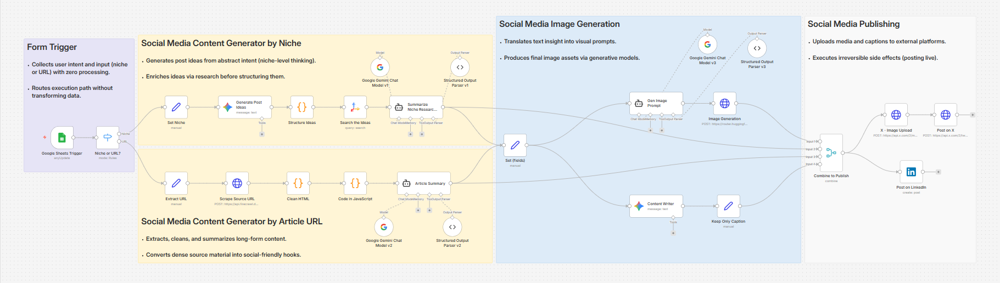

# Social Media Publishing Agent

An automated n8n workflow that transforms a niche topic or article URL into a complete social media post with AI-generated copy, image, and automatic publishing to LinkedIn and X (Twitter).

## 🎯 What It Does

This workflow eliminates manual content creation by automating the entire pipeline:
- **Input**: A niche topic or article URL via Google Sheets
- **Processing**: Researches, summarizes, writes viral copy, and generates images
- **Output**: Publishes complete posts to LinkedIn and X automatically

## 🏗️ Workflow Architecture




## 🔄 How It Works

### Trigger
- Monitors a Google Sheets document for new rows
- Polls every minute for changes

### Two Processing Paths

#### Path 1: Niche-Based Content
1. **Idea Generation**: Uses Google Gemini to generate 3 content ideas from the niche topic
2. **Web Research**: Searches for relevant information using Tavily API
3. **Insight Extraction**: Summarizes research into one strong, shareable insight

#### Path 2: URL-Based Content
1. **Content Scraping**: Fetches article content using Firecrawl
2. **Text Cleaning**: Removes HTML/markdown and normalizes text
3. **Smart Truncation**: Extracts first ~3500 characters at sentence boundaries
4. **Summarization**: Distills article into a 2-sentence hook

### Content Creation & Publishing
Both paths converge to:
1. **Caption Writing**: Generates viral social media copy with title, caption, and hashtags
2. **Image Prompt Creation**: Crafts detailed, photorealistic image generation prompts
3. **Image Generation**: Creates visuals using FLUX.1-schnell via HuggingFace
4. **Multi-Platform Publishing**:
   - Uploads image and posts to LinkedIn
   - Uploads media and tweets to X

## 🛠️ Setup Instructions

### 1. Google Sheets Configuration
Create a spreadsheet with these columns:
- **Content Type**: Either "Niche" or "URL"
- **Idea**: Your niche topic (e.g., "MLOps best practices") or article URL

Example:
| Content Type | Idea |
|--------------|------|
| Niche | AI ethics in healthcare |
| URL | https://example.com/article |

### 2. Required API Credentials

Configure the following integrations in n8n:

| Service | Purpose | Required Credentials |
|---------|---------|---------------------|
| **Google Sheets** | Trigger source | OAuth2 |
| **Google Gemini** | Content generation & summarization | API Key (3 separate instances) |
| **Tavily** | Web research | API Key |
| **Firecrawl** | URL scraping | Bearer Token |
| **HuggingFace** | Image generation (FLUX.1-schnell) | Access Token |
| **LinkedIn** | Publishing | OAuth2 |
| **X (Twitter)** | Publishing & media upload | OAuth2 |

### 3. Credential Setup Details

#### Google Gemini
- Obtain API key from [Google AI Studio](https://makersuite.google.com/app/apikey)
- Create 3 separate credential entries (used for different workflow stages)

#### Firecrawl
- Sign up at [Firecrawl](https://firecrawl.dev)
- Replace `<FIRECRAWL_TOKEN>` in the "Scrape Source URL" node

#### HuggingFace
- Get access token from [HuggingFace Settings](https://huggingface.co/settings/tokens)
- Replace `<HF_ACCESS_TOKEN>` in the "Image Generation" node

#### X (Twitter)
- Create a Twitter Developer account
- Set up OAuth 2.0 app with read/write permissions
- Replace `<X_TOKEN>` in both X-related nodes

#### LinkedIn
- Configure OAuth2 app in LinkedIn Developer Portal
- Update the `person` parameter in "Post on LinkedIn" node with your LinkedIn URN

### 4. Testing

Before going live:
1. **Test Niche Path**: Add a row with Content Type = "Niche"
2. **Test URL Path**: Add a row with Content Type = "URL"
3. **Verify Outputs**: Check each node's JSON output for errors
4. **Dry Run Publishing**: Temporarily disable publishing nodes to test content generation

### 5. Activation

Once tested:
1. Activate the workflow in n8n
2. Any new row in Google Sheets will trigger automatic execution
3. Posts will be published live to both platforms

## ⚠️ Important Notes

### Rate Limits & Costs
- **HuggingFace**: Monitor usage of FLUX.1-schnell model
- **Tavily**: Max 2 search results per query (configurable)
- **API Quotas**: Ensure sufficient quotas for Gemini, Firecrawl

### Error Handling
- Expired credentials will cause mid-flow failures with no automatic recovery
- No built-in retry logic for failed publishes
- Monitor execution logs regularly

### Content Safety
- Posts are published immediately without manual review
- Ensure input topics comply with platform content policies
- Review generated captions before enabling automation

## 📋 Workflow Structure

```
Trigger (Google Sheets)
  ↓
Router (Niche vs URL)
  ↓
┌─────────────────┬──────────────────┐
│  Niche Path     │   URL Path       │
│  - Generate     │   - Scrape       │
│  - Research     │   - Clean        │
│  - Summarize    │   - Summarize    │
└─────────────────┴──────────────────┘
  ↓
Content Creation
  - Write Caption
  - Generate Image Prompt
  - Create Image
  ↓
Publishing
  - LinkedIn Post
  - X Post (with media upload)
```

## 🔧 Customization Options

### Adjust Image Generation
Modify the prompt in "Gen Image Prompt" node for different visual styles.

### Change Search Depth
Update `max_results` parameter in "Search the Ideas" node (default: 2).

### Modify Caption Style
Edit the system prompt in "Content Writer" node to change tone or format.

### Text Truncation
Adjust `MAX_CHARS` constant in "Code in JavaScript" node (default: 3500).

## 🐛 Troubleshooting

| Issue | Solution |
|-------|----------|
| No ideas generated | Check Google Gemini API quota and credentials |
| Scraping fails | Verify Firecrawl token and URL accessibility |
| Image generation timeout | Increase retry settings or check HuggingFace status |
| LinkedIn post fails | Verify OAuth2 token and person URN |
| X post fails | Check OAuth2 credentials and media upload permissions |

---

## 👤 Author

**Dhyan Patel**  
AI/ML & Automation Builder  
🔗 [LinkedIn](https://linkedin.com/in/dhyan2815) • [GitHub](https://github.com/dhyan2815)
