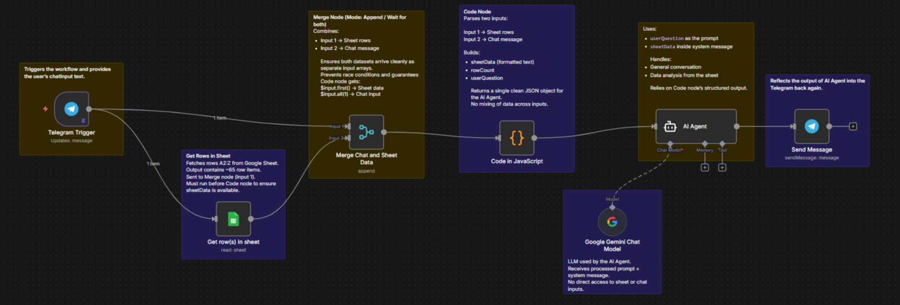

# 🤖 Chat with Google Sheets via Telegram

This repository contains an **n8n workflow** that allows users to **chat with a Google Sheet through Telegram** using natural language.  
The workflow fetches spreadsheet rows, formats them into structured text, and passes them to a **Gemini-powered AI Agent** that can either analyze the sheet or respond to casual conversation.

This is a **read-only analytics bot** — it does **not** modify Google Sheets.

---

## 📌 What This Workflow Actually Does

- Accepts messages **only from Telegram**
- Fetches rows from a single Google Sheet
- Converts sheet rows into AI-readable text
- Uses a Gemini LLM to:
  - Answer general chat questions
  - Analyze the sheet **strictly using provided data**
- Sends the response back to the same Telegram chat

No hallucinated data.  
No guessing.  
No hidden integrations.

---

## 🧠 Core Capabilities

- Natural language queries on spreadsheet data  
- Telegram-based conversational interface  
- Strict rule-based AI behavior (general chat vs sheet analysis)  
- Row-level referencing using actual row numbers  
- Automatic handling of empty or insufficient sheet data  

---

## 🏗️ Workflow Architecture

### High-Level Flow

1. **Telegram Trigger**  
   Receives incoming user messages from a Telegram bot.

2. **Google Sheets – Get Row(s)**  
   Fetches rows from a specified spreadsheet and sheet.

3. **Merge Node (Append / Wait for Both)**  
   Ensures both:
   - Telegram message  
   - Google Sheets rows  
   arrive before processing.

4. **Code (JavaScript) Node**  
   - Detects message source  
   - Extracts:
     - `userQuestion`
     - `chatId`
   - Formats sheet rows into readable structured text  
   - Limits output to **50 rows max** (token control)

5. **AI Agent (LangChain)**  
   - Uses `userQuestion` as the prompt  
   - Injects formatted `sheetData` into the system message  
   - Enforces strict behavioral rules

6. **Google Gemini Chat Model**  
   - LLM used by the agent  
   - Has **no direct access** to raw sheet or Telegram data

7. **Telegram Send Message**  
   Sends the final AI output back to the user.

---

## 🧩 Workflow Nodes Breakdown

| Node | Purpose |
|-----|--------|
| **Telegram Trigger** | Entry point for user messages |
| **Google Sheets – Get Row(s)** | Reads spreadsheet data |
| **Merge Chat and Sheet Data** | Synchronizes inputs |
| **Code in JavaScript** | Formats data + extracts question |
| **AI Agent** | Decides between chat vs sheet analysis |
| **Google Gemini Chat Model** | Generates the response |
| **Send Message (Telegram)** | Replies to the user |

---

## 🤖 AI Behavior Rules (Hard Constraints)

The AI Agent follows **non-negotiable rules**:

### General Conversation
If the user asks:
- “Hi”
- “Who are you?”
- “What do you do?”

→ Respond like a normal assistant.

### Sheet-Related Queries
If the user asks:
- “What’s in row 5?”
- “Which entries have status = pending?”
- “How many rows are there?”

→ Analyze **only** the provided sheet data.

### Missing or Empty Data
- Empty sheet → *“The sheet is empty.”*
- Insufficient data → *“The sheet does not contain the information needed.”*

No hallucinations.  
No assumptions.  
No external knowledge.

---

## 🔒 Limitations (Be Honest About Them)

- ❌ Read-only (no insert/update/delete rows)
- ❌ Single sheet only
- ❌ Telegram-only
- ❌ No authentication or role separation
- ❌ Limited to ~50 rows per query

If someone claims this is a “full Sheets AI agent,” they’re wrong.

---